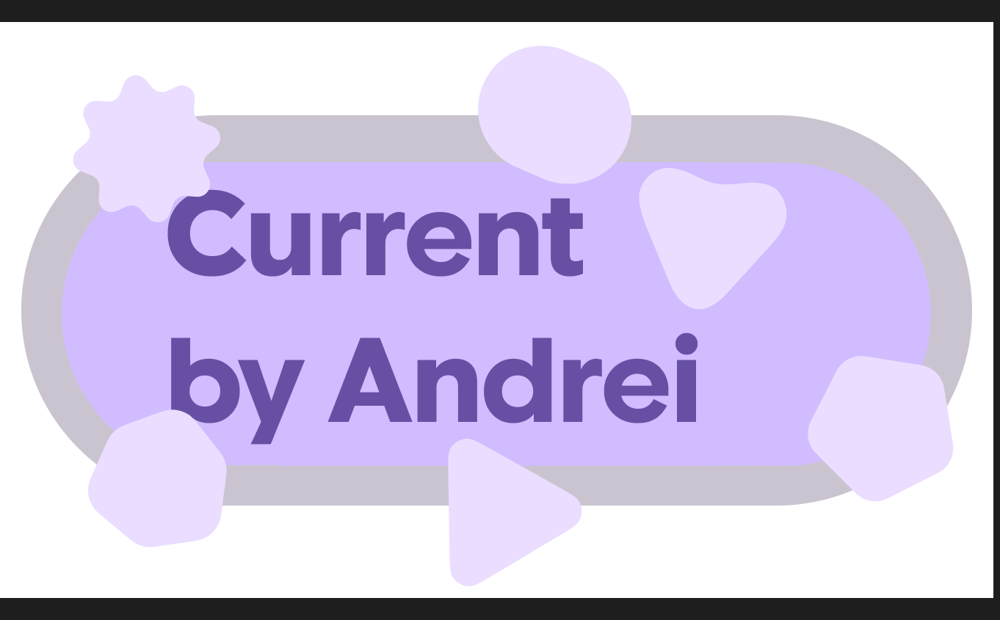

# Current

  
  
  
  

---

## 💡 Overview

> **Current** is a next-generation Android application built from the ground up with a full **Material 3 Expressive** design system. Featuring dynamic colors, spring-based physics, and rounded grouped cards, Current delivers a fluid, high-end user experience tailored for modern devices.

---

## 🎨 Design & Aesthetics

<table>
  <tr>
    <td width="50%">
      <h3>🔮 Material 3 Expressive</h3>
      
Embraces dynamic color tokens, organic shapes, and pill-based components for a playful yet elite user interface.

    </td>
    <td width="50%">
      <h3>⚡ Fluid Architecture</h3>
      
Powered by clean geometry, responsive layouts, and modern MVVM principles using Jetpack Compose.

    </td>
  </tr>
</table>

---

## 🚀 Tech Stack & Tooling

| Layer | Technology | Purpose |
| :--- | :--- | :--- |
| **Language** | Kotlin | Core logic & app development |
| **UI Framework** | Jetpack Compose | Declarative Material 3 UI components |
| **Design System** | Figma & Material 3 Kit | Custom organic blobs & typography |
| **Environment** | Android Studio | Native build pipeline |

---

  
<b>Crafted with precision and love by Andrei</b>

